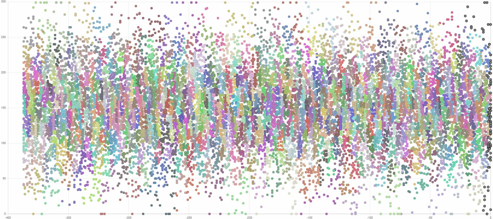

# 游戏匹配服务器(拷贝自https://github.com/ganlvtech/go-game-matching)

## 目标

进入匹配队列的玩家都有一个 rank 分数，开始匹配后尽可能匹配到分数相近的玩家。

如果等待时间稍长，则可以匹配到分数差距更大的玩家。

分数相近的玩家，先进入队列的要优先开始游戏。

## 效果展示

每秒约 40 个玩家，正态分布，分数的上下限为 3σ 位置。每组匹配 25 个玩家，图中相邻的相同颜色的点为同一组，灰色的点为仍在匹配中玩家。

中心平均匹配时间约为 1 ~ 3 秒，高分低分玩家需要约 15 ~ 30 秒才能匹配成功，平均小组分数标准差约为 10 分（因为我设定初始分数区间就是正负 10 分）



## 算法

### 思考

分数容忍区间随时间增长，但不一定是线性的。分数容忍区间可能有最大范围，也可能是无穷大。

有一个预计匹配时间，根据近期分数相近玩家匹配时间和队列人数统计得出

有一个最长时间，超过最长时间，执行特定操作（如取消匹配或强行开始游戏）

### 匹配算法

加入队列时，将玩家放进一个二维的坐标系中，横轴是时间戳，纵轴是分数。同时还有另外一个队列专门记录按玩家按加入队列时间排序。

每秒执行一次匹配，按加入时间顺序依次尝试匹配，先加入的玩家有优先尝试匹配的权利。

每位玩家尝试匹配的算法如下，获取分数容忍区间中最先加入的玩家（这些玩家中优先分数相近的），直到获取够一个房间的人数停止，或者分数区间中的人数不够停止。

预计匹配时间是根据此分段玩家，此次匹配时间与上一秒预计匹配时间求平均。为了让没有玩家时匹配时间变成最长等待时间，每次计算平均时间时，把上一秒的预计时间 +1 秒，这样如果没有人平均，预计时间就会不断增加。

### 实现技巧

为了方便搜索不同分数区间，二维的坐标系做了一个分区域，数据结构就是 `data[][]`，第一个下标是时间整除一个数，第二个下表是分数整除一个数，例如每 3 秒的玩家、分数差在 10 分以内的玩家分为一组。

匹配时间也是按分段来的，每 10 分一个组，这个组内的玩家匹配时间统一平均。

由于分数容忍区间会增大，人少的情况可能存在两个相邻的区间，一个显示很快能匹配到，而另一个却显示最长匹配时间。这里采用一个高斯模糊的方式，对相邻 5 个区间进行高斯模糊，权重为 `1 4 6 4 1`。

## 使用说明

### 以库函数方式引用

参考 `main.go` 中的调用方法使用 `./matcher` 的库
 
### 以微服务方式使用

直接运行 `go build` 生成的可执行文件 `./go-game-matching :8000`，则会开启一个支持 `/join` `/status` `/leave` `/remove` `/stats` 等 API 的服务器。

> 如果 go build 遇到问题，可以尝试使用 <https://goproxy.io/>

## Benchmark

由于算法原理是单匹配队列、统一分配，面对人数少的队列效果比其他实现方式要好很多，能做到在人少的情况下也尽量公平匹配。

在人数超多情况下的没法快速匹配，由于人数多会抢锁，难以达到超高的每秒匹配人数，这也是所有玩家同一队列、所有玩家统一分配的弊端。

我的个人笔记本电脑配置，i5-4200H 2.8GHz 超频 3.3GHz，内存 4GB DDR3 1600MHz。

```
$ cd matcher
$ go test -bench . -test.benchtime 1000000x
goos: windows
goarch: amd64
pkg: github.com/ww169920503/go-game-matching/matcher
BenchmarkMatcher_Match-4                 1000000              2332 ns/op
BenchmarkMatcher_Match_1000-4            1000000              3865 ns/op
```

```
$ cd agent
$ go test -bench ^BenchmarkHttpMatchingServer_HandleJoin$ -test.benchtime 10000x
goos: windows
goarch: amd64
pkg: github.com/ww169920503/go-game-matching/agent
BenchmarkHttpMatchingServer_HandleJoin-4           10000           1861338 ns/op
PASS
ok      github.com/ww169920503/go-game-matching/agent     19.752s
```

```
$ cd agent
$ go test -bench ^BenchmarkHttpMatchingServer_HandleJoin_100$ -test.benchtime 100000x
goos: windows
goarch: amd64
pkg: github.com/ww169920503/go-game-matching/agent
BenchmarkHttpMatchingServer_HandleJoin_100-4      100000             57537 ns/op
PASS
ok      github.com/ww169920503/go-game-matching/agent     6.889s
```

25 个人一组的房间。不使用网络，仅测试匹配性能，单 goroutine 每秒能匹配 50 万人，1000 并发 goroutine 每秒能匹配 30 万人。使用 HTTP 协议，启用 KeepAlive，关闭 Windows Defender，本机测试，单线程循环发送请求、等待回应极慢，100 并发时每秒大约能匹配 1.6 万个玩家，如果服务器和客户端分成两个进程，100 并发时每秒大约能匹配 2.4 万个玩家。

根据上面的测试也可以知道大部分时间花在网络处理上，一般只要单机的网络允许，并发人数应该不是问题。

如果游戏有百万同时在线，每 100 秒一局游戏，每秒有 1 万人同时匹配，那么应该还是能应付。

另外，同房间人数越少，所需计算时间会降低，分数分布越均匀所需计算时间会降低。不过计算时间还是与队列人数相关性最显著。

这其中还有一个有趣的问题，当人数少的时候，服务器压力本身就很小，当人数多的时候，由于各分段玩家很多，匹配几乎瞬间就能完成，列表不需要遍历到非常深的位置。人数中等偏少的时候是 CPU 密集，人数很多时是 IO 密集，总体来看还是人数多的时候比较麻烦。

## LICENSE

MIT License
